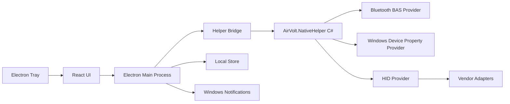

# AirVolt 软件设计文档

日期：2026-05-17  
状态：设计草案  
目标平台：Windows 10/11  
推荐技术栈：Electron + React + TypeScript + C# .NET Helper

## 1. 产品定位

AirVolt 是一款 Windows 桌面托盘软件，用于集中显示无线外设的电量状态。首版重点支持蓝牙设备和 Windows 已经暴露电量属性的外设；2.4G 接收器设备通过后续厂商适配器逐步支持。

AirVolt 不承诺读取所有无线设备电量。软件应明确区分三种状态：

- 可读取：显示百分比、电量状态、更新时间。
- 暂不可读取：设备存在，但系统或协议未暴露电量。
- 未知：设备刚连接、读取失败、权限不足或适配器异常。

核心产品价值是让用户不用打开多个厂商软件，就能在一个轻量托盘面板里查看键盘、鼠标、耳机、手柄等设备的电量。

## 2. MVP 范围

首版只做 Windows，优先完成稳定可用的基础能力。

### 2.1 必须支持

- 系统托盘常驻。
- 托盘弹窗显示设备列表。
- 显示设备名称、类型、连接方式、电量百分比、更新时间。
- 读取 Bluetooth LE Battery Service。
- 读取 Windows 设备属性中的电量信息。
- 低电量系统通知。
- 本地缓存上次成功读取的电量。
- 设置页：开机启动、低电量阈值、刷新间隔、通知开关。

### 2.2 暂不支持

- macOS / Linux。
- 手机端。
- 云同步。
- 复杂账号系统。
- 所有 2.4G 设备自动兼容。
- 深度控制设备，如调 DPI、灯效、按键映射。

## 3. 高层架构

AirVolt 使用 Electron 负责桌面壳、托盘、窗口、通知和前端 UI；C# helper 负责调用 Windows 原生 API 读取设备信息。两者通过本地进程 IPC 通信。



### 3.1 选择 Electron 的原因

- 适合做托盘应用、弹窗面板、设置页。
- React + TypeScript 开发效率高。
- 与 Twinkle Tray 的产品形态接近，便于参考托盘交互和 Windows 桌面体验。
- 打包、自动更新、开机启动生态成熟。

### 3.2 选择 C# Helper 的原因

- Windows 蓝牙、设备枚举、HID 和系统属性读取更自然。
- 比 Node 原生扩展更容易调试和维护。
- 可以独立崩溃隔离，helper 异常不拖垮 UI。
- 后续可以把厂商适配器拆成更清晰的 C# 模块。

## 4. 进程划分

### 4.1 Electron Main

职责：

- 创建托盘图标。
- 管理主窗口和托盘弹窗。
- 启动、监控、重启 C# helper。
- 与 helper 通信。
- 缓存设备状态。
- 触发低电量通知。
- 管理用户设置。

建议目录：

```text
apps/desktop/src/main/
  index.ts
  tray.ts
  helperClient.ts
  notificationService.ts
  settingsStore.ts
  deviceStore.ts
```

### 4.2 React Renderer

职责：

- 显示设备列表。
- 显示设置页。
- 提供设备筛选和刷新按钮。
- 呈现异常状态。

建议目录：

```text
apps/desktop/src/renderer/
  App.tsx
  components/
    DeviceList.tsx
    DeviceItem.tsx
    BatteryMeter.tsx
    SettingsPanel.tsx
  styles/
```

### 4.3 C# Native Helper

职责：

- 枚举蓝牙和 HID 设备。
- 读取设备电量。
- 归一化设备数据。
- 按 Provider 聚合结果。
- 对外提供简单 JSON-RPC 或 line-delimited JSON 协议。

建议目录：

```text
native/AirVolt.NativeHelper/
  Program.cs
  Protocol/
  Providers/
    IDeviceBatteryProvider.cs
    BluetoothBasProvider.cs
    WindowsDevicePropertyProvider.cs
    HidProvider.cs
  VendorAdapters/
    LogitechAdapter.cs
  Models/
    DeviceBatterySnapshot.cs
```

## 5. 数据模型

统一设备模型由 helper 返回，Electron 主进程负责缓存和分发给 UI。

```ts
type DeviceBatterySnapshot = {
  id: string;
  name: string;
  kind: "mouse" | "keyboard" | "headset" | "controller" | "pen" | "unknown";
  connection: "bluetooth-le" | "bluetooth-classic" | "usb-2.4g" | "usb" | "unknown";
  battery: {
    percentage: number | null;
    status: "available" | "unsupported" | "unknown" | "error";
    charging?: boolean | null;
    levelText?: "low" | "medium" | "high" | null;
  };
  provider: "bluetooth-bas" | "windows-device-property" | "hid" | "vendor-logitech" | "cache";
  lastSeenAt: string;
  updatedAt: string | null;
  error?: {
    code: string;
    message: string;
  };
};
```

## 6. Helper 通信协议

首版建议使用 stdin/stdout 的 line-delimited JSON，避免一开始引入本地 HTTP 服务。

请求示例：

```json
{"id":"1","method":"devices.scan","params":{"includeUnsupported":true}}
```

响应示例：

```json
{"id":"1","ok":true,"result":{"devices":[]}}
```

事件示例：

```json
{"event":"devices.changed","payload":{"devices":[]}}
```

基础方法：

- `devices.scan`：立即扫描。
- `devices.watch.start`：开始监听设备变化。
- `devices.watch.stop`：停止监听。
- `helper.health`：健康检查。
- `helper.version`：返回 helper 版本。

## 7. 设备读取策略

AirVolt 按优先级读取设备电量，避免重复显示同一设备。

### 7.1 Provider 优先级

1. 厂商适配器：如果能稳定识别设备和读取电量，优先使用。
2. Bluetooth BAS：适用于标准蓝牙低功耗设备。
3. Windows Device Property：适用于系统已经暴露电量的设备。
4. HID Provider：尝试读取 HID usage / feature report。
5. Cache：设备暂时不可读时显示上次成功结果。

### 7.2 蓝牙设备

Bluetooth LE 设备优先读取 Battery Service 的 Battery Level characteristic。读取失败时再退回 Windows 设备属性。

注意事项：

- 有些设备只在连接瞬间或电量变化时更新。
- 有些耳机包含多块电池，首版可先显示主设备电量。
- 读取频率不要过高，建议默认 5 分钟刷新一次。

### 7.3 2.4G 设备

2.4G 接收器没有统一标准。首版只做识别和状态展示，不强行承诺读取所有电量。

后续按品牌适配：

- Logitech：优先研究 HID++。
- Xbox Controller：独立适配。
- Razer / Corsair / SteelSeries：优先查官方 SDK 或可读 HID 报告。

每个厂商适配器必须满足：

- 能稳定识别设备。
- 不影响原设备输入。
- 读取失败时不频繁重试。
- 不需要管理员权限作为首选路径。

## 8. UI 设计

AirVolt 的 UI 应该像一个安静、可靠的桌面工具，而不是营销页。

### 8.1 托盘弹窗

主要内容：

- 顶部：AirVolt 标题、刷新按钮、设置按钮。
- 中部：设备列表。
- 底部：最后刷新时间和扫描状态。

设备项显示：

- 设备图标。
- 设备名称。
- 连接方式标签。
- 电量条和百分比。
- 状态文本，如“刚刚更新”“不支持电量读取”“读取失败”。

### 8.2 设置页

设置项：

- 开机启动。
- 刷新间隔：1 / 5 / 15 / 30 分钟。
- 低电量阈值：10% / 15% / 20% / 自定义。
- 是否显示不支持的设备。
- 是否启用实验性 2.4G 适配器。
- 导出诊断日志。

## 9. 本地存储

Electron 主进程保存用户设置和设备缓存。

建议文件：

```text
%APPDATA%/AirVolt/settings.json
%APPDATA%/AirVolt/device-cache.json
%APPDATA%/AirVolt/logs/main.log
%APPDATA%/AirVolt/logs/helper.log
```

缓存字段：

- 设备 id。
- 最近名称。
- 最近电量。
- 最近读取时间。
- provider。
- 错误计数。

## 10. 错误处理

AirVolt 的错误处理原则是：不打扰用户，但让问题可诊断。

典型错误：

- helper 启动失败。
- helper 崩溃。
- 设备读取超时。
- 权限不足。
- 协议不支持。
- 设备断开。

UI 展示：

- 单个设备读取失败：设备项内显示轻量状态。
- helper 整体不可用：托盘弹窗顶部显示错误状态和重试按钮。
- 低电量：系统通知。

日志要求：

- 默认记录 info、warn、error。
- 不记录敏感信息。
- 诊断导出时包含软件版本、系统版本、provider 结果和错误码。

## 11. 测试策略

### 11.1 单元测试

- TypeScript：设置存储、设备合并、通知阈值。
- C#：provider 结果归一化、错误码、缓存合并逻辑。

### 11.2 集成测试

- Electron 能启动 helper。
- helper 能响应 `helper.health`。
- helper 崩溃后 Electron 能重启。
- 扫描结果能正确渲染到 UI。

### 11.3 手动设备测试

至少准备：

- 一款 Bluetooth LE 鼠标。
- 一款 Bluetooth LE 键盘。
- 一款蓝牙耳机。
- 一款 Logitech 2.4G 鼠标或键盘。
- 一款不支持电量读取的普通 USB HID 设备。

测试结果要记录设备型号、连接方式、是否可读、provider、准确性。

## 12. 里程碑

### M0：项目骨架

- Electron + React + TypeScript 桌面项目。
- C# helper 项目。
- 主进程能启动 helper 并进行 health check。

### M1：设备列表 MVP

- helper 返回模拟设备数据。
- UI 显示托盘弹窗和设备列表。
- 设置页可保存基础设置。

### M2：Windows 电量读取

- 实现 Windows Device Property Provider。
- 实现 Bluetooth BAS Provider。
- 设备去重和缓存。

### M3：通知和稳定性

- 低电量通知。
- helper 崩溃恢复。
- 日志和诊断导出。

### M4：2.4G 实验支持

- 实现 HID Provider 基础扫描。
- 添加第一个厂商适配器，建议 Logitech。
- 设置页提供实验性开关。

### M5：打包发布

- electron-builder 打包。
- 安装包。
- 代码签名预留。
- 自动更新预留。

## 13. 关键技术决策

### ADR-001：使用 Electron 构建桌面体验

决策：AirVolt 使用 Electron + React + TypeScript 构建桌面 UI。

原因：

- 托盘应用和设置页开发效率高。
- 与 Twinkle Tray 的成熟产品形态接近。
- 便于后续做自动更新和跨平台 UI 扩展。

代价：

- 资源占用高于纯原生应用。
- 需要控制后台轮询和窗口生命周期。

### ADR-002：使用 C# Helper 读取设备数据

决策：底层设备读取放在 C# .NET helper 中，不直接在 Electron 里做。

原因：

- Windows API 使用更顺。
- 设备读取异常可以与 UI 隔离。
- 后续厂商适配器可独立演进。

代价：

- 打包需要携带 helper。
- IPC 协议需要维护。

### ADR-003：2.4G 采用插件式厂商适配

决策：2.4G 设备不做“通用承诺”，采用厂商适配器逐步支持。

原因：

- 2.4G 电量没有统一协议。
- 厂商私有协议差异大。
- 插件式结构可以降低主程序复杂度。

代价：

- 早期兼容设备有限。
- 需要维护设备兼容列表。

## 14. 风险与缓解

| 风险 | 影响 | 缓解 |
| --- | --- | --- |
| 设备不暴露电量 | 用户认为软件无效 | UI 明确显示“不支持电量读取”，维护兼容列表 |
| 2.4G 厂商协议复杂 | 开发周期拉长 | MVP 不阻塞 2.4G，后续插件化 |
| helper 崩溃 | 软件不可用 | Electron 主进程监控并自动重启 |
| 电量不准确 | 用户信任下降 | 显示更新时间，避免过度刷新 |
| Windows 权限限制 | 某些 HID 不可读 | 优先使用系统属性和标准蓝牙服务 |
| Electron 资源占用 | 后台软件体验差 | 控制窗口生命周期和轮询频率 |

## 15. 推荐下一步

下一步应进入实现计划阶段：

1. 初始化 monorepo。
2. 搭建 Electron + React + TypeScript。
3. 搭建 C# helper。
4. 实现 helper health check。
5. 用模拟设备数据打通 UI。
6. 再接入真实 Windows 设备读取。

建议先完成 M0 和 M1，再处理真实设备协议。这样可以尽早看到 AirVolt 的产品形态，也能把后续复杂的设备读取隔离在 helper 里逐步攻克。
